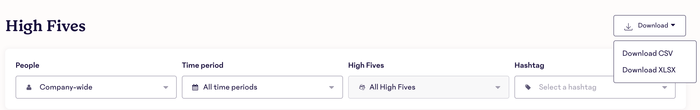

# High Fives

A script to bring to light trends in your 15Five High Five data!

## Prerequisites

* [15Five](https://my.15five.com/) access
* Postgres
* Terminal access

## Usage

Navigate to [High Fives](https://my.15five.com/dashboard/high_fives/) in 15Five.
Export all data as a CSV and put in the project folder

Run this bash script from your terminal

`./high_fives_report.sh {name_of_file.csv}`
